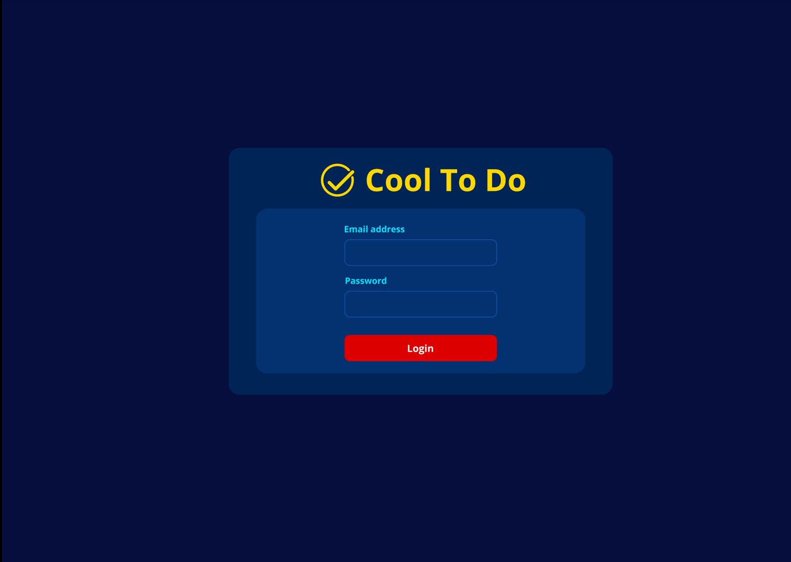
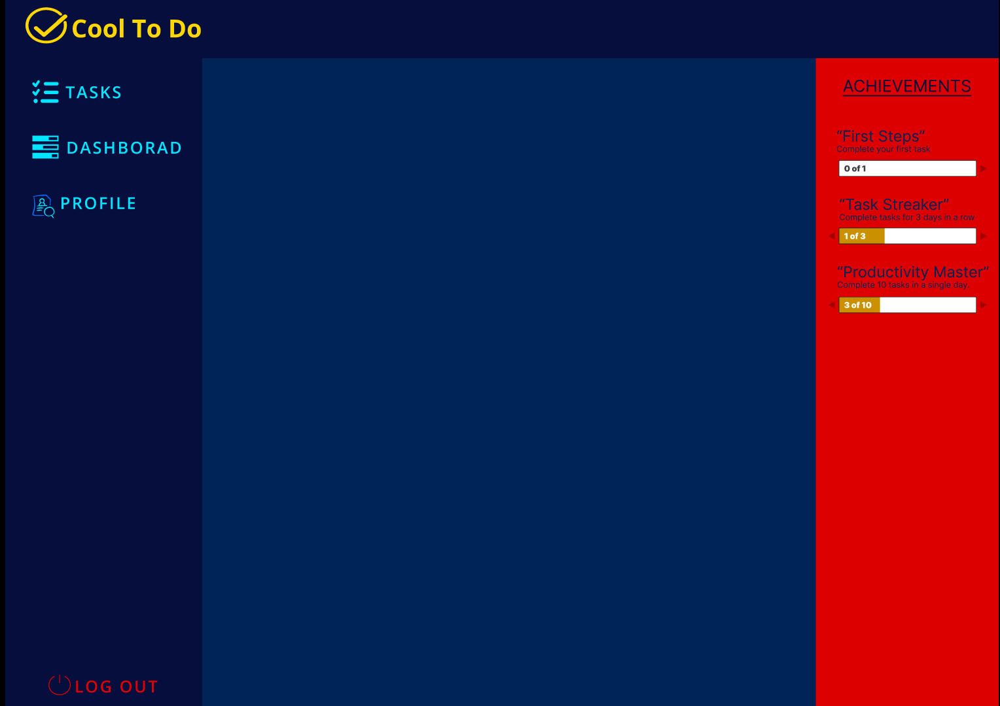
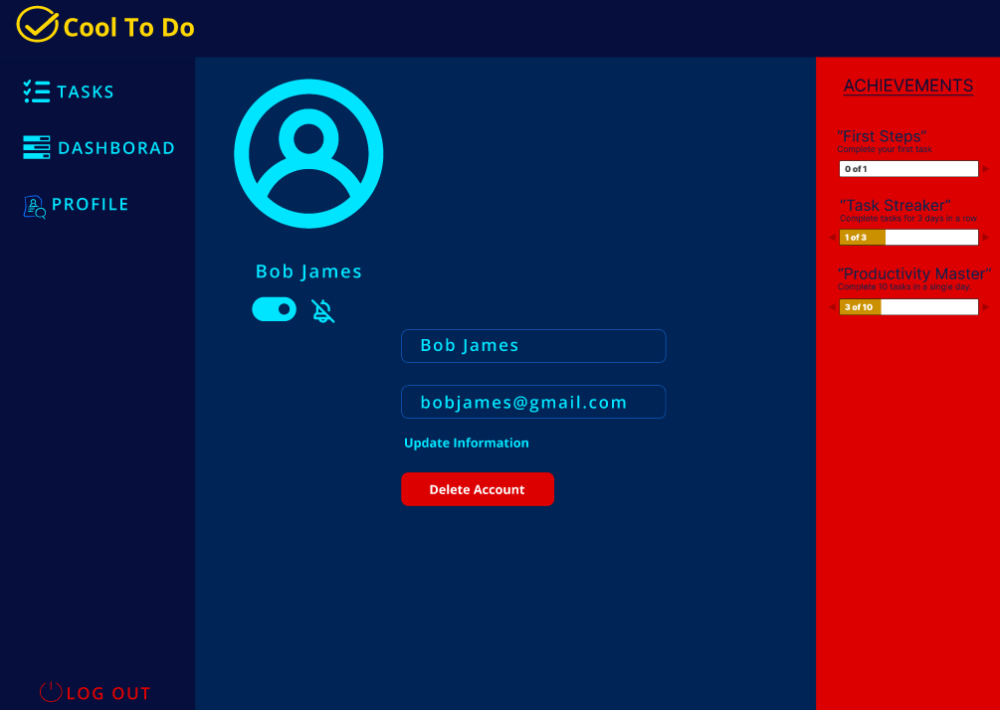

<div align="center">


# Cool To Do

**A real-time task manager built with Next.js, TypeScript, and Firebase.**

[](https://nextjs.org/)
[](https://www.typescriptlang.org/)
[](https://react.dev/)
[](https://firebase.google.com/docs/auth)
[](https://firebase.google.com/docs/firestore)
[](https://tailwindcss.com/)

**[Live Demo](https://cool-to-do-two.vercel.app/) &middot; [Report an Issue](https://github.com/Christopher-Hanovich/cool-to-do/issues)**

</div>

---

## About

Cool To Do is a full-stack task management web app built with the Next.js App Router. Users can
create an account, log in, reset a forgotten password, and manage a personal task list — complete
with titles, descriptions, and due dates — that stays in sync in real time using Cloud Firestore.
Each user only ever sees their own tasks, enforced both in the UI and by Firestore security rules.

This was built as a **group project** for coursework at SAIT (Southern Alberta Institute of
Technology), developed collaboratively with two other contributors.

## Screenshots

<div align="center">

**Login**



**Dashboard**



**Profile**



</div>

## Features

- **Authentication** — sign up, log in with email *or* username, log out, and reset a forgotten password via email (Firebase Authentication)
- **Form validation** — signup and login forms validated with Formik + Yup, including password strength rules and username-uniqueness checks against Firestore
- **Real-time task list** — tasks sync live from Cloud Firestore using `onSnapshot`, scoped to the signed-in user and sorted by due date
- **Task management** — create, edit, and delete tasks with a title, description, start date, and due date
- **Dashboard** — a personalized welcome screen with quick idea prompts alongside the task table
- **Profile page** — view and update your display name
- **Per-user data isolation** — Firestore security rules restrict every read/write to the authenticated owner of that data

## Tech Stack

| Layer | Technologies |
|---|---|
| Frontend | Next.js 16 (App Router), React 19, TypeScript |
| Styling | Tailwind CSS 4 |
| Forms & Validation | Formik, Yup |
| Auth & Database | Firebase Authentication, Cloud Firestore |
| Tooling | ESLint, npm |

## Architecture

```
┌───────────────────────────────┐
│        Next.js Frontend       │
│  Login · Sign Up · Reset      │
│  Tasks Dashboard · Profile    │
│  (Formik + Yup validation)    │
└───────────────┬───────────────┘
                │
                ▼
┌───────────────────────────────┐
│        Firebase Auth          │
│  Email/password sessions      │
└───────────────┬───────────────┘
                │
                ▼
┌───────────────────────────────┐
│       Cloud Firestore         │
│  users/{uid}, tasks/{taskId}  │
│  Real-time sync (onSnapshot)  │
│  Access scoped by firestore   │
│  .rules to request.auth.uid   │
└───────────────────────────────┘
```

Security rules and Firebase project configuration (`firestore.rules`, `firebase.json`) are checked
into version control so they can be reviewed in pull requests and deployed via the Firebase CLI,
rather than edited only in the Firebase console.

## Technical Challenges

- **Firestore left in open test mode.** The default rules generated when the Firestore database was
  created would have allowed broad read/write access. The rules were rewritten to check
  `request.auth.uid` against the document owner for both the `users` and `tasks` collections, and
  committed as `firestore.rules` so future changes are reviewable.
- **An exposed Firebase API key.** A live API key had been hardcoded into the Firebase config file
  and committed to the repo. The key was rotated in the Firebase console, and Firebase config
  values were migrated to `NEXT_PUBLIC_FIREBASE_*` environment variables loaded from a git-ignored
  `.env.local` file.
- **Coordinating a shared codebase.** With three people building different pages against the same
  Firestore collections, keeping data shapes, query scoping, and listener cleanup (`onSnapshot`
  unsubscribes) consistent across pages took ongoing coordination.

## Lessons Learned

- Firebase's default "test mode" rules are a real security risk and should never be assumed safe —
  they need to be checked and replaced explicitly before any real user data touches the database.
- A committed secret isn't fixed by deleting the line — it's still in git history, so rotating the
  credential itself is the only real fix, alongside moving future secrets into environment variables.
- Real-time listeners (`onSnapshot`) are powerful but need careful query scoping and cleanup to
  avoid leaking data across users or leaving stale subscriptions active.
- Working as a small team on a shared Next.js/Firebase codebase reinforced the value of clear
  ownership over specific pages and components while everyone stayed familiar with the shared
  data layer.

## Getting Started

### Prerequisites

- Node.js 18+
- npm
- A Firebase project with **Authentication (Email/Password)** and **Cloud Firestore** enabled

### Installation

```bash
git clone https://github.com/Christopher-Hanovich/cool-to-do.git
cd cool-to-do
npm install
```

### Environment variables

Create a `.env.local` file in the project root with your own Firebase project's config values
(found in Firebase Console → Project Settings → General → Your apps):

```bash
NEXT_PUBLIC_FIREBASE_API_KEY=
NEXT_PUBLIC_FIREBASE_AUTH_DOMAIN=
NEXT_PUBLIC_FIREBASE_PROJECT_ID=
NEXT_PUBLIC_FIREBASE_STORAGE_BUCKET=
NEXT_PUBLIC_FIREBASE_MESSAGING_SENDER_ID=
NEXT_PUBLIC_FIREBASE_APP_ID=
```

### Firestore rules (optional)

To deploy the included security rules with the [Firebase CLI](https://firebase.google.com/docs/cli):

```bash
firebase login
firebase deploy --only firestore:rules
```

### Run the app

```bash
npm run dev
# or yarn dev / pnpm dev / bun dev
```

Open [http://localhost:3000](http://localhost:3000) in your browser.

### Deployment

The app is deployed on [Vercel](https://vercel.com/), the platform built by the creators of
Next.js — live at **[cool-to-do-two.vercel.app](https://cool-to-do-two.vercel.app/)**.

## Project Structure

```
cool-to-do/
├── app/
│   ├── page.tsx              # Root route — renders the login screen
│   ├── login.tsx             # Login form (email or username + password)
│   ├── signup/
│   │   ├── page.tsx
│   │   └── signup.tsx        # Sign-up form and validation
│   ├── reset/
│   │   ├── page.tsx
│   │   └── reset.tsx         # Password reset form
│   ├── tasks/
│   │   └── page.tsx          # Dashboard — real-time task list, create/edit/delete
│   ├── profile/
│   │   └── page.tsx          # Profile page
│   ├── components/
│   │   └── left-side-bar.tsx # Shared sidebar navigation
│   ├── utils/
│   │   ├── firebase.ts       # Firebase app/auth/Firestore initialization
│   │   ├── firestore.ts      # Firestore helper functions
│   │   └── useAuth.ts        # Auth state hook
│   └── globals.css
├── firestore.rules           # Version-controlled Firestore security rules
├── firebase.json             # Firebase CLI configuration
├── docs/screenshots/         # README screenshots
└── public/                   # Logo and static assets
```

## Future Improvements

- Add automated testing (unit and integration tests) — there is currently no test suite
- Wire the task "mark as done" checkbox up to Firestore so completion state persists
- Wire up the "Delete Account" button on the profile page
- Add task filtering/sorting options (e.g., by completion status)
- Improve error handling and user feedback (e.g., toast notifications instead of `alert`/inline text)
- Set up CI to run linting and builds automatically on pull requests

## License / Educational Purpose

This project was built as a group coursework project at SAIT (Southern Alberta Institute of
Technology) for educational purposes. It is not licensed for commercial use — feel free to explore
the code and architecture for learning purposes.
